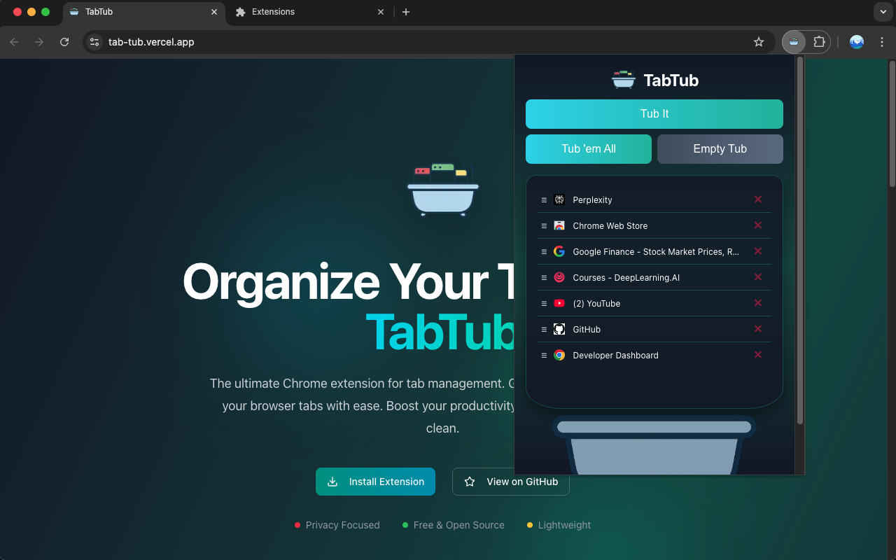

# TabTub

Effortlessly manage your browser tabs with TabTub – a simple yet powerful Chrome extension designed to help you organize and revisit important links with ease.

## 🚀 Features

*   **Quick Tab Capture:** Instantly save your current active tab or all open tabs to your personal "tub."
*   **Intuitive Management:** Easily remove individual tabs or clear your entire tub with a single click.
*   **Cross-Device Sync:** Your saved tabs automatically sync across all Chrome browsers where you're signed in, thanks to `chrome.storage.sync`.
*   **Visual Tub:** A clear visual representation of your saved tabs, making organization straightforward.
*   **Duplicates Prevention:** Avoid clutter; the "Tub 'em All" feature intelligently prevents adding tabs that are already in your tub.

## 💡 Usage

TabTub provides a streamlined way to keep your browsing organized:

*   **Tub It:** Click this button to save the tab you are currently viewing into your tub.
*   **Tub 'em All:** Save all tabs from your current browser window into the tub. Duplicate URLs are automatically ignored.
*   **Empty Tub:** Clear all saved tabs from your tub. A confirmation prompt ensures you don't accidentally delete your collection.
*   **Remove Individual Tab (X):** Each tab in the tub has a small 'X' button to remove it individually.

## 📸 Preview



## ⚙️ Installation

### Manual Installation (Developer Mode)

To get TabTub running in your Chrome browser:

1.  **Clone or Download:**
    *   **Clone the repository:**
        ```bash
        git clone https://github.com/vineetsarpal/tab-tub.git
        ```
    *   **Alternatively, download** the ZIP file and extract its contents to a local folder.

2.  **Open Chrome Extensions:**
    *   Navigate to `chrome://extensions/` in your Chrome browser.

3.  **Enable Developer Mode:**
    *   In the top right corner of the Extensions page, toggle on **Developer mode**.

4.  **Load Unpacked Extension:**
    *   Click the **Load unpacked** button that appears.
    *   Browse to and select the directory where you cloned or extracted the TabTub files.

5.  **Pin to Toolbar (Optional):**
    *   Once loaded, the TabTub icon should appear in your browser's toolbar. If not, click the puzzle piece icon (Extensions) and pin TabTub for easy access.

### Keyboard Shortcut (Optional)

You can set a custom keyboard shortcut to quickly open the TabTub popup:

1.  Go to `chrome://extensions/shortcuts` in your browser.
2.  Find "TabTub" in the list.
3.  Click the pencil icon next to "Activate the extension" and assign your preferred shortcut (e.g., `Ctrl+Shift+U` / `Cmd+Shift+U`).

## 📄 License

This project is licensed under the MIT License. See the `LICENSE.md` file for more details.
