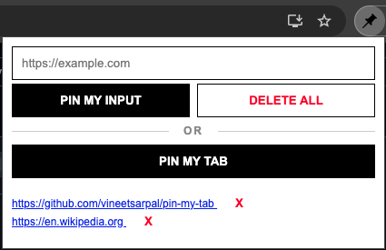

# Tab Tub

A Chrome extension that lets you easily bookmark your current browser tab / custom URLs, helping you organize important links for quick access.


## Preview



## Features

- Quickly save, remove, and manage tabs with a single click
- Manage multiple tabs effortlessly
- Improve productivity by keeping important tabs organized

## Usage
- Pin My Tab: Pin the current tab you are on
- Pin My Input: Provide a manual URL in the input box to pin that URL
- Delete All: Remove all pinned links
- X: Remove the individual link


## Installation

### Manual Installation (Developer Mode)

1. **Clone or Download the Repository**  
   - Clone the repo:
     ```sh
     git clone https://github.com/vineetsarpal/pin-my-tab.git
     ```
   - Or download the ZIP file and extract it

2. **Open Chrome and Navigate to Extensions**  
   - Go to `chrome://extensions/` in your browser
   - Enable **Developer mode** (top right corner)

3. **Load Unpacked Extension**  
   - Click on **Load unpacked**
   - Select the directory where you cloned or extracted the extension files

4. The extension should now appear in your browser’s toolbar


## License
This project is licensed under the MIT License - see the [LICENSE.md](LICENSE.md) file for details.